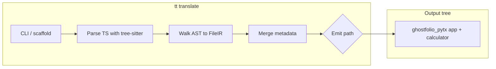
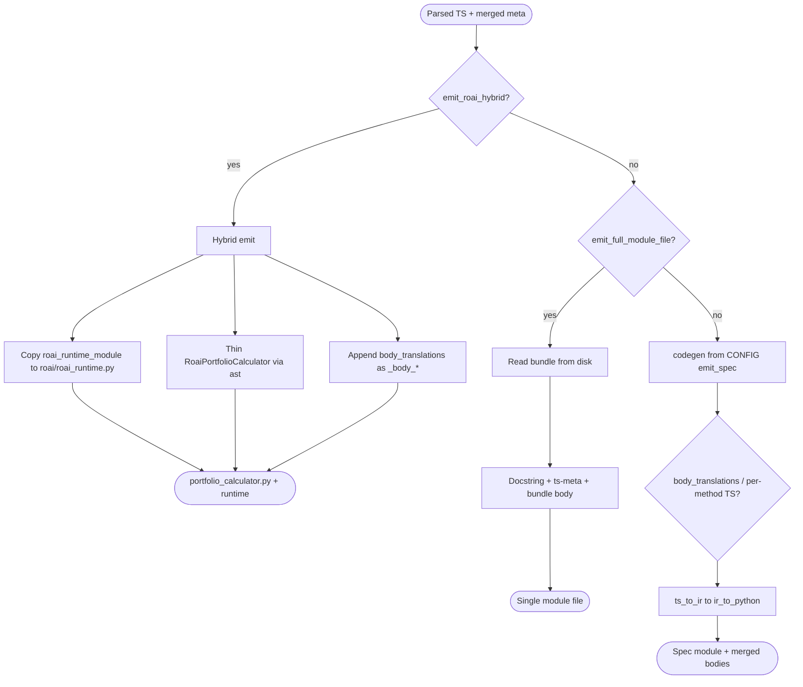
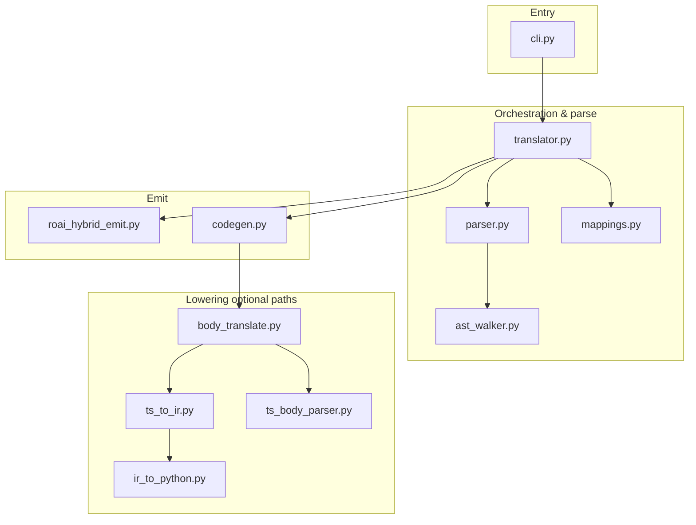
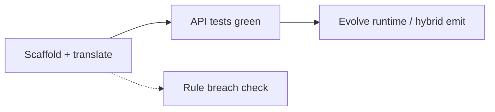

# Explanation of the submission

## Solution

### What `tt` is

The **translation tool** lives under `tt/`. It is invoked as:

```bash
uv run --project tt tt translate
```

(`-o` / `--output` selects the translation directory; default is `translations/ghostfolio_pytx/`.)

It does **not** paste arbitrary strings from TypeScript into Python as raw text. The pipeline is built around **tree-sitter** parsing, a small **IR**, and **Python `ast`** emission, driven by **`tt_project_config.py`** (`CONFIG` dict) beside the output project (legacy `tt_import_map.json` is still accepted).

### End-to-end flow



1. **Scaffold** — `tt translate` runs `helptools/setup_ghostfolio_scaffold_for_tt.py`, which:
   - Copies `translations/ghostfolio_pytx_example/` as the FastAPI base (routes, wiring, `pyproject.toml`, etc.).
   - Overlays shared support code from `tt/tt/scaffold/ghostfolio_pytx/` (wrappers, interfaces, base `PortfolioCalculator`, etc.).
   - Copies `helptools/translation_config/ghostfolio_pytx/tt_project_config.py` into the output tree as `tt_project_config.py` (project-specific config stays outside `tt/tt` for rule checks).

2. **Parse & walk** — `tt/tt/translator.py` loads `tt_project_config.py` → `CONFIG` → `typescript_sources`, loads each file from the repo root, parses with **TypeScript tree-sitter** (`tt/tt/parser.py`), and walks the syntax tree (`tt/tt/ast_walker.py`) to collect classes, method names, and **raw method body** text. Metadata is merged (`class_names`, `total_method_count`, `file_count`) for the emitted header comment.

3. **Emit `RoaiPortfolioCalculator`** — Behavior is controlled by `tt_project_config.py` in the output tree (canonical source: `helptools/translation_config/ghostfolio_pytx/tt_project_config.py`). The translator tries emit modes **in order** (see diagram below).

#### Emit decision (order matters)



- **`emit_roai_hybrid` (current Ghostfolio setup)** — `tt/tt/roai_hybrid_emit.py` copies `helptools/roai_runtime.py` (path from `roai_runtime_module`) next to the calculator, emits a thin **`RoaiPortfolioCalculator`** facade built with **`ast`** (delegates to **`RoaiPortfolioEngine`**), and merges **`body_translations`** into the class as `_body_*` helpers. **tt still parses real Ghostfolio TypeScript** for metadata and optional per-method lowering.

- **`emit_full_module_file` (optional)** — The full module body is read from the path in config (under repo `helptools/` or beside the output config). The translator writes a module docstring, `# ts-meta: …` from the real TypeScript parse, and the file contents to `portfolio_calculator.py`.

- **Default / spec path (when neither hybrid nor bundle applies)** — `tt/tt/codegen.py` reads the **`emit_spec`** dict from `CONFIG` (or a sibling `.py` / `.json` file if `emit_spec_file` is set) and builds method bodies from a **declarative expression/statement DSL** (lists tagged with `name`, `call_meth`, `min_field`, etc.) into Python `ast`, then unparses.  
  Optionally, `body_translations` in `CONFIG` lists TypeScript methods whose bodies are converted **statement-by-statement** via `ts_to_ir` → `ir_to_python` (`tt/tt/body_translate.py`, `tt/tt/ts_to_ir.py`, `tt/tt/ir_to_python.py`): wrap TS snippet as a fake method, parse, lower to IR, emit Python `ast.FunctionDef`. Failed translations are skipped with warnings.

### Main TT modules (architecture)



| Module | Role |
|--------|------|
| `tt/cli.py` | Subcommands; runs scaffold then `run_translation`. |
| `tt/translator.py` | Orchestrates parse → IR metadata → emit (hybrid, bundle, or spec + extras). |
| `tt/roai_hybrid_emit.py` | Hybrid path: copy runtime, thin facade `ast`, merge `body_translations`. |
| `tt/parser.py` | Lazy tree-sitter TypeScript parser. |
| `tt/ast_walker.py` | `FileIR` / `ClassIR` / `MethodIR`: classes, extends, method bodies as text. |
| `tt/ts_to_ir.py` | TS `statement_block` nodes → JSON-like IR (assign, if, for-of, return, calls, etc.). |
| `tt/ts_body_parser.py` | Wraps a method body string so tree-sitter can parse it. |
| `tt/ir_to_python.py` | IR → Python `ast` (e.g. `new Big` → `Decimal`, `cloneDeep` → `deepcopy`, member calls to operators where mapped). |
| `tt/codegen.py` | Declarative emit spec → full class AST; merges translated body functions when used. |
| `tt/mappings.py` | Load `tt_project_config.py` / legacy JSON; generic text rules and naming helpers. |

### What the emitted calculator does (runtime + facade)

`RoaiPortfolioCalculator` subclasses `PortfolioCalculator` from the wrapper layer. Core portfolio logic lives in **`RoaiPortfolioEngine`** (`roai_runtime.py`); the class exposes the behaviors the **Ghostfolio API tests** exercise:

- **Ledger / replay** — chronological activities (BUY, SELL, DIVIDEND, FEE, LIABILITY) with ordering; tracks quantities, investment basis, fees, peaks, short-cover cost, and realized P&L-style adjustments where needed.
- **`get_performance`** — Builds a **daily chart** from first activity through `date.today()` (and historical price dates), replaying state per day, combining market values via `CurrentRateService`, net performance, investment deltas, and fee accumulation; returns `firstOrderDate` and aggregate `performance` block.
- **`get_holdings`**, **`get_details`**, **`get_investments`**, **`get_dividends`** — Holdings and summary shapes expected by tests; optional `group_by` for investments/dividends (`month` / `year`).
- **`evaluate_report`** — Minimal **xRay**-shaped dict with categories and rule counts toggled by whether open positions exist.

Helper functions in the runtime module support chart and investment series consistency.

Numeric work in the runtime may use **float** for speed and simplicity; the IR layer still knows how to emit `Decimal` when the spec/body path is used.

### Coding approach



1. **Scaffold first** — Ensure the FastAPI app and wrapper contracts match the example project; focus translator output on `app/implementation/.../roai/` (`portfolio_calculator.py`, `roai_runtime.py` when using hybrid).

2. **Red/green on API tests** — Use `make translate-and-test-ghostfolio_pytx` (translate + spin up + pytest) or `make spinup-and-test-ghostfolio_pytx` when the tree is already generated.

3. **Calculator evolution** — The full ROAI surface area is large; the team converged on a **Python runtime module + thin emitted facade** while keeping **tree-sitter + IR + codegen** in `tt` for real TS ingestion and for optional incremental **per-method** body translation from Ghostfolio’s `portfolio-calculator.ts` files.

4. **Compliance** — Run `make detect_rule_breaches` before submitting; do not modify files under `evaluate/`. Full scoring-style run: `make evaluate_tt_ghostfolio`.
